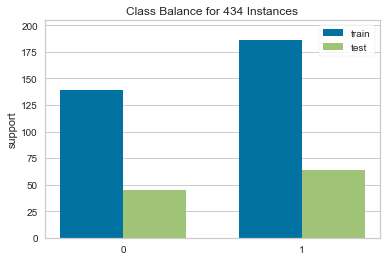
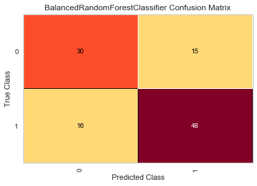

# Stock Price Movement Predictor
*Columbia FinTech Project 2: Machine Learning*

---

**Team Members:**
* **Jeneia Mullins**
* **JC Soliman**
* **Manpreet Padam**

---

## The FinTech Problem
Equity analysts spend hours listening to and reading through quarterly earnings calls and transcripts to identify signals for which they make trading decisions. Natural Language Process and Machine Learning can process these transcripts (faster than humans) to analyze sentiment and key themes. As a result, traders that utilize these technologies can invest faster to realize greater Alpha.

## Project Objective
Utilize NLP to calculate earnings reports’ sentiment and analyze the correlation to changes in that company’s respective stock price

## The Solution
Using a 3-prong approach, we built and analyzed multiple machine learning models using Natural Language Processing (NLP) to predict price movements post earnings calls:
* **Go Deep (Linear Regression Time Series)** - predicted the movement of 1 stock price (Goldman Sachs: GS) post earnings calls each quarter over the period of 5 years
* **Go Broad (Logistic Regression and Ensemble Learning Classifiers)** - predicted the movement of S&P 500 stocks post earnings calls that occured in Q3 2019 using classifier models
* **Go Neuro (TensorFlow)** - predicted the movement of S&P 500 stocks post earnings calls that occured in Q3 2019 using classifier models using neural networks

---

## Data Exploration

As quarterly earnings reports are listed publicly on Company websites, we assumed the public data would be easy to obtain. Although public, the data is not structured in a format that is easy to analyze. We purchased subscriptions to download earnings transcripts from Seeking Alpha and stock price data from SimFin. We then analyzed the sentiments in each earnings’ report. And along with other financiial data such as stock price percent change and stock price volatilty to stock price changes, we built models to predict stock price movements.

## Data Gathering and Cleanup Process

1. Download stock price data from [SimFin](https://simfin.com) and earnings transcripts from [Seeking Alpha](https://seekingalpha.com)
2. Develop classes to automate the:
   * text processing of transcripts from the downloaded pdf files using `textract.process`
   * calculation of positive, negative and neutral sentiment scores for each transcript
   * build of sentiments dataframe
   * removal of unnecessary columns from the SimFin stock price data table
   * calculation of stock price momentum as measured by the 12-day rolling percent change mean
   * calculation of stock price volatily as measured by the 12-day rolling standard deviation
   * merge of sentiments and stock price dataframe
3. Run classes pre-execution of machine learning models

---

## The Models

### **Linear Regression Time Series Model**

### **Classifier Models**

#### **The Techniques**
Logistic regression and ensemble learning are the two machine learning classifiers employed to predict stock price movement both 1 day after and 3 days after the earnings call. Binary values were used to indicate stock price movements:
* **1** - Stock Price Goes Up
* **0** - Stock Price Goes Down (or remains flat)

After resampling the imbalanced S&P 500 data set, the `LogisticRegression` algorithm from Scikit-learn library was used. Four resampling techniques used include:
* `RandomOverSampler`
* `SMOTE`
* `ClusterCentroids`
* `SMOTEENN`

For ensemble learning, the following algorithm classifiers from imbalanced-learn were used:
* `BalancedRandomForestClassifier`
* `EasyEnsembleClassifier`

#### The Features

* **Month** the earnings call occured
* **Stock price momentum** as measured by 12-day rolling mean
* **Stock price volatility** as measured by 12-day rolling standard deviation
* All sentiment scores
   * **positive**
   * **negative**
   * **neutral**

#### Scaling the Data
Data was not scaled prior to training as it is not required. The default solver, `liblinear`, used for logistic regression handles unscaled data. The tree-based models used for ensemble learning are not distance based and can handle varying ranges of data, hence it is not required.

#### **Class Imbalance and Splitting the Data**

We see an imbalanced binary data set - 434 data points split into 250 `upward movement (1)` and 184 `downward movement`. To address the imbalance, as laid out in later sections, we employed re-sampling techniques.


Using the `train_test_split` from Sci-kit learn, we get the following split between training and testing data:

**Split for 1 day post earnings call** | **Split for 3 days post earnings call**
:-------------------------:|:-------------------------:
 | 
*Train* `0`: 139, `1`: 186 | `0`: 139, `1`: 186
*Test* `0`: 45, `1`: 64 | `0`: 38,`1`: 71

----

#### **Model Evaluation Metrics**

The three primary metrics we will be looking at to evaluate our models are:
* Recall Score
* Balanced Accuracy Score
* Geometric Mean Score

Across these metrics, the closer they are to 1 the better.

#### **Precision vs Recall**
Due to the nature of the data and the objective of the analysis, we will be paying more attention to recall as opposed to precision. In predicting stock price movement, recall is a preferrable measure to precision - one would rather predict that the stock price went down when it actually went up (False Negative) than predict it went up when it actually went down (False Positive).


#### **Accuracy Scores**
The other metric we want to pay attention to is **specificity**. Essentially the inverse of recall, it tells how good the model is at predicting high-risk loans when they actually are (True Negative).


To provide us a combined view of the recall and specificity, we will be looking at both the **balanced accuracy score** and **geometric mean score**, arithmetic and geometric mean of recall and specificity.


#### Visualizing the metrics
To visualize the classifier analysis and relevant metrics, libraries from `yellowbrick` were utilized.


```
from yellowbrick.target import ClassBalance
```
```
from yellowbrick.classifier import ConfusionMatrix
```
```
from yellowbrick.classifier import ClassificationReport
```
----

#### **Re-sampling Techniques for Logistic Regression Models**

In this section, we will compare various logistic regression models to predict credit risk by employing various re-sampling techniques. To ensure consistency across these techniques, `random_state` of 1 will be used. The default solver `liblinear` was deemed appropriate for the data as it can handle unscaled datasets.

1. **Oversampling**

- Employing the `RandomOverSampler` from imbalanced-learn, we see the `0` class resampled to match the 186 data points of the in-sample `1` class. As expected, the `SMOTE` method yielded the same number of re-sampled datapoints.

- **Split for 1 day post earnings call**

RandomOverSampler | SMOTE
:-------------------------:|:-------------------------:
  | 

- **Split for 3 days post earnings call**

RandomOverSampler | SMOTE
:-------------------------:|:-------------------------:
  | 


2. **Undersampling using ClusterCentroids**

- Using the `ClusterCentroids` algorithm from imbalanced-learn, we can expect the `1`  in-sample class to match the 139 data points of `0` in-sample class.

**Split for 1 day post earnings call** | **Split for 3 days post earnings call**
:-------------------------:|:-------------------------:
  | 


3. #### **Over and Under Sampling using SMOTEEN**

- The `SMOTEENN` method gives us interestingly low data points:

**Split for 1 day post earnings call** | **Split for 3 days post earnings call**
:-------------------------:|:-------------------------:
  | 


#### **Logistic Regression and Ensemble Learning Results**

Across the three metrics below and for predicting price movements for both 1 day and 3 days after the earnings call, we see the ensemble learning models performed better than the logistic regression models, with `BalancedRandomForest` marginally outperforming `EasyBalance AdaBoost`. `SMOTEEN`, on the other hand, performed the worst across the board.

While the logistic regression models exhibited lower scores, it's interesting to note that they perform better in predicting 1-day post call price movements.

**1 Day post earnings call**
|  | Recall | Balanced Accuracy | Geometric Mean |
| :---: | :---: | :---: | :---: |
| `RandomOverSampler` | 0.62| 0.62| 0.62 |
| `SMOTE` | 0.56| 0.61 | 0.61 |
| `ClusterCentroids` | 0.73| 0.68| 0.68 |
| `SMOTEENN` | 0.00| 0.50 | 0.00 |
| `BalancedRandomForest` | 0.75| 0.71 | 0.71 |
| `EasyBalance AdaBoost` | 0.69| 0.68 | 0.68 |
| **Best Score** | *`BalancedRandomForest`*| *`BalancedRandomForest`*| *`BalancedRandomForest`* |
| **Worst Score** | *`SMOTEENN`*| *`SMOTEENN`*| *`SMOTEENN`* |

**3 Days post earnings call**
|  | Recall | Balanced Accuracy | Geometric Mean |
| :---: | :---: | :---: | :---: |
| `RandomOverSampler` | 0.49| 0.46| 0.46 |
| `SMOTE` | 0.51| 0.44 | 0.43 |
| `ClusterCentroids` | 0.44| 0.46| 0.45 |
| `SMOTEENN` | 0.03| 0.49 | 0.16 |
| `BalancedRandomForest` | 0.83| 0.82 | 0.82 |
| `EasyBalance AdaBoost` | 0.82| 0.82 | 0.82 |
| **Best Score** | *`BalancedRandomForest`*| *`BalancedRandomForest`*| *`BalancedRandomForest`* |
| **Worst Score** | *`SMOTEENN`*| *`SMOTEENN`*| *`SMOTEENN`* |

#### *Closer Look at BalancedRandomForest Metrics*

Technique | Confusion Matrix | Classification Report
:-------------------------:|:-------------------------: | :-------------------------:
*1 Day Post Earnings Call* |  | 
*3 Days Post Earnings Call* |  | 


Of the 64 upward-movers 1 day post earnings call, the model predicted 48 stock prices going up correctly, a recall score of 75%. Conversely, only 30 of the 45 downward-movers (67% recall score) were predicted correctly by the model. Three days post earnings call, the model performed even better with 59 of 71 (83%) upward-movers and 30 of 45 (82%) of downward-movers predicted correctly.

Investigating the importance of each feature, the most important feature is the 12-day stock price momentum.

**1 day post earnings call** | **3 days post earnings call**
:-------------------------:|:-------------------------:
  | 


### **TensorFlow**


----

### Appendix - Classifier Models Metrics Visualization

**1 Day Post Earnings Call**

Technique | Confusion Matrix | Classification Report
:-------------------------:|:-------------------------: | :-------------------------:
*Random Over Sampling* |  | 
*SMOTE* |  | 
*ClusterCentroids* |  | 
*SMOTEEN* |  | 
*BalancedRandomForest* |  | 
*EasyBalance AdaBoost* |  | 


**3 Days Post Earnings Call**

*Random Over Sampling Metrics*

Technique | Confusion Matrix | Classification Report
:-------------------------:|:-------------------------: | :-------------------------:
*Random Over Sampling* |  | 
*SMOTE* |  | 
*ClusterCentroids* |  | 
*SMOTEEN* |  | 
*BalancedRandomForest* |  | 
*EasyBalance AdaBoost* |  | 
